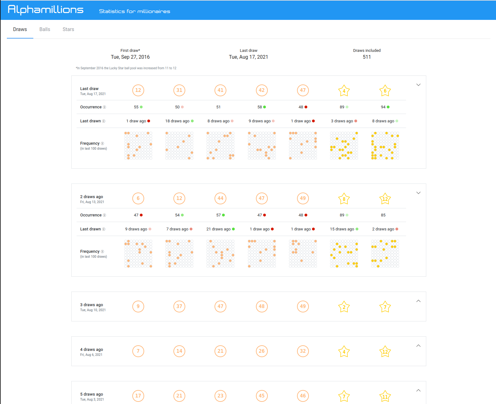
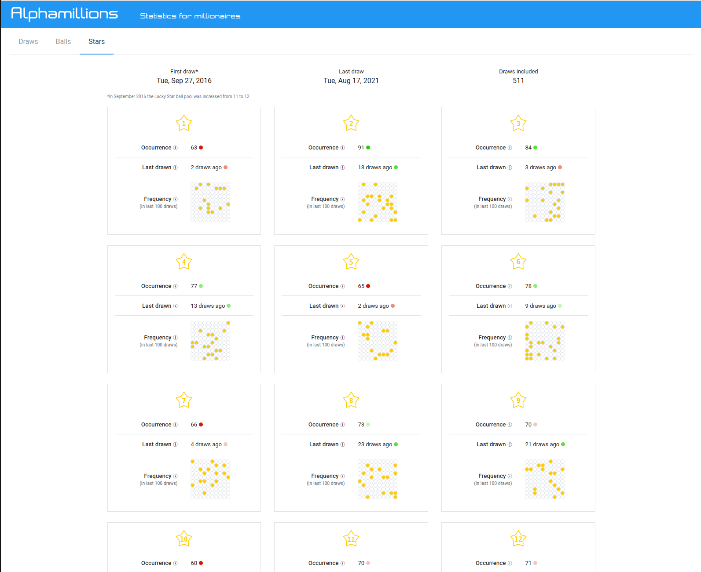

# Alphamillions

Website displaying the results of Euromillion lottery draws and the statistics of each number.

The aim of this website was to use the framework `Vue.js` along with several other frontend technologies.

## Screenshots
Draws


Balls


Stars


## Usage

```bash
npm install
```

### Compiles and hot-reloads for development

```bash
npm run serve
```
